# Schemat Relacyjnej Bazy Danych SQLite (Ewidencja OZiPZ)

Wykonywalnym źródłem schematu jest `src/db/sqlite-migrations.ts` (`SCHEMA_VERSION = 13`). Zarówno aplikacja, jak i skrypt inicjalizacji używają tej samej migracji. Poniższy opis encji należy czytać wraz z ograniczeniami opisanymi niżej.

## Aktualizacja i integralność (2026-09-09)

- `PRAGMA user_version` identyfikuje wersję schematu. Przed aktualizacją istniejącego pliku powstaje spójna kopia SQLite `*.before-migration-1-<czas>.db`, uwzględniająca dziennik WAL.
- v12 (2026-09-30): zgłoszenie szkoły nie zawiera już liczby oddziałów ani rodziców (`classes_count`, `parents_count` usunięte; wartości zostają tylko w kopii sprzed migracji). Dochodzi opcjonalny drugi koordynator (`second_coordinator_*`), powiązany ze Spisem Kontaktów na tych samych zasadach co pierwszy.
- v13 (2026-10-01): zgłoszenie szkoły może mieć plik zgłoszenia (`application_file`) – ścieżkę względną do kopii w folderze `Zgłoszenia/<rok szkolny>/` obok pliku bazy. Same pliki nie są częścią bazy ani jej kopii zapasowych.
- v5 (2026-09-27): placówki mają własne `email`/`phone` sekretariatu. Przy aktualizacji kontakt zapisany w polach koordynatora bez nazwiska przechodzi do tych kolumn, prefiks „Gmina” znika z nazwy gminy (zmiana spływa do powiązanych działań i zgłoszeń), a z `notes` usuwane są wyłącznie wpisy importu dublujące inne pola.
- Migracja przebudowuje stare tabele w jednej transakcji, zachowuje rekordy i sprawdza klucze obce przed zatwierdzeniem. Duplikaty, błędne relacje lub nieznane kolumny przerywają migrację; rekordy nie są automatycznie usuwane ani scalane.
- Obowiązuje 25 kluczy obcych. Udział placówki jest unikalny dla `(program_id, facility_id, school_year)`. Placówki ani programu z udziałami nie można usunąć (`RESTRICT`); usunięcie zgłoszenia jest osobną, jawną operacją.
- Liczniki muszą być całkowite i nieujemne; liczba działań i ilość dystrybucji muszą być dodatnie, miesiąc mieścić się w zakresie 1–12, a flagi przyjmują 0 lub 1. Kolumny opcjonalne nadal dopuszczają `NULL`.
- Kopie nazw w powiązanych działaniach, udziałach, sprawach, skanach, kontaktach i rejestrach są synchronizowane wyzwalaczami z placówką lub programem. Zmiana nazwy jest też widoczna od razu w stanie interfejsu.
- Serwer HTTP działa na `127.0.0.1`. API wymaga lokalnego adresu klienta, poprawnego nagłówka Host, zgodnego Origin i tokenu aplikacji; odrzuca żądania między witrynami. Transakcje są przypisane do karty, a operacje w jednej karcie wykonują się kolejno. Wersja desktopowa korzysta z puli z jednym połączeniem.
- Błąd otwarcia lub migracji rozpoznanej bazy SQLite jest zgłaszany użytkownikowi; nie powoduje przejścia do innego magazynu danych.

Ręczna aktualizacja: `node scripts/migrate-db.js [ścieżka-do-bazy]` (Node.js 24). Po aktualizacji uruchom aplikację ponownie. Kopie odzyskiwania są wyłączone z Git.

---

## 1. Diagram Relacji Encji (ERD Mermaid)

```mermaid
erDiagram
    %% Samoodniesienie: Zespoły Szkół
    ozipz_facilities ||--o{ ozipz_facilities : "zespół szkół (parent_facility_id, SET NULL)"

    %% Relacje Placówek (ozipz_facilities)
    ozipz_facilities ||--o{ ozipz_participations : "uczestniczy (RESTRICT)"
    ozipz_facilities ||--o{ ozipz_actions : "lokalizacja (SET NULL)"
    ozipz_facilities ||--o{ ozipz_distributions : "odbiorca (SET NULL)"
    ozipz_facilities ||--o{ ozipz_schedule : "miejsce (SET NULL)"
    ozipz_facilities ||--o{ ozipz_jrwa_cases : "podmiot sprawy (SET NULL)"
    ozipz_facilities ||--o{ ozipz_letters : "nadawca/adresat (SET NULL)"
    ozipz_facilities ||--o{ ozipz_scans : "dotyczy placówki (SET NULL)"
    ozipz_facilities ||--o{ ozipz_contacts : "koordynatorzy szkolni (SET NULL)"
    ozipz_facilities ||--o{ ozipz_registers : "placówka w rejestrze (SET NULL)"

    %% Relacje Programów (ozipz_programs)
    ozipz_programs ||--o{ ozipz_participations : "program (RESTRICT)"
    ozipz_programs ||--o{ ozipz_actions : "program edukacyjny (SET NULL)"
    ozipz_programs ||--o{ ozipz_jrwa_cases : "teczka programu (SET NULL)"
    ozipz_programs ||--o{ ozipz_letters : "dotyczy programu (SET NULL)"
    ozipz_programs ||--o{ ozipz_scans : "skany programu (SET NULL)"
    ozipz_programs ||--o{ ozipz_registers : "rejestr programu (SET NULL)"

    %% Relacje Materiałów (ozipz_materials)
    ozipz_materials ||--o{ ozipz_actions : "wykorzystany materiał (SET NULL)"
    ozipz_materials ||--o{ ozipz_distributions : "rozdzielnik materiału (SET NULL)"

    %% Relacje Dwukierunkowe / Powiązania Działań Edukacyjnych (ozipz_actions)
    ozipz_actions ||--o{ ozipz_distributions : "rozdzielnik z działania (action_id, SET NULL)"
    ozipz_actions ||--o{ ozipz_publications : "publikacja z działania (action_id, SET NULL)"
    ozipz_actions ||--o{ ozipz_schedule : "powiązane zadanie harmonogramu (schedule_event_id, SET NULL)"
    ozipz_schedule ||--o{ ozipz_actions : "zrealizowane działanie (action_id, SET NULL)"
    ozipz_actions ||--o{ ozipz_jrwa_cases : "powiązana sprawa JRWA (jrwa_case_id, SET NULL)"
    ozipz_jrwa_cases ||--o{ ozipz_actions : "działanie inicjujące sprawę (action_id, SET NULL)"

    %% Konsumenci Słowników Dynamicznych (ozipz_dictionaries)
    ozipz_dictionaries ||--o{ ozipz_actions : "activityType, recipientGroup, campaign, municipality"
    ozipz_dictionaries ||--o{ ozipz_facilities : "locationType, municipality"
    ozipz_dictionaries ||--o{ ozipz_staff : "staffRole"
    ozipz_dictionaries ||--o{ ozipz_contacts : "contactPosition"
    ozipz_dictionaries ||--o{ ozipz_materials : "materialType"
    ozipz_dictionaries ||--o{ ozipz_scans : "documentType"
    ozipz_dictionaries ||--o{ ozipz_schedule : "annotationReason"
    ozipz_dictionaries ||--o{ ozipz_jrwa_cases : "jrwaSymbol"
```

---

## 2. Obsługa Relacji Dwukierunkowych i Cykli ("Chicken-and-Egg")

W systemie występują dwie relacje dwustronne z opcjonalnymi kluczami obcymi `SET NULL`:
1. `ozipz_actions.schedule_event_id` $\leftrightarrow$ `ozipz_schedule.action_id`
2. `ozipz_actions.jrwa_case_id` $\leftrightarrow$ `ozipz_jrwa_cases.action_id`

### Strategia Wykonywania Operacji (2-Phase Transactional Execution)
Wszystkie kolumny łączące w obu kierunkach są typu **`TEXT NULL`** z regułą **`ON DELETE SET NULL`**. Dzięki temu nie występuje blokada kluczy obcych przy wstawianiu nowych rekordów (`INSERT`):
- **Scenariusz A (Działanie tworzy sprawę JRWA / zadanie planu)**:
  1. `INSERT INTO ozipz_actions` (tymczasowo z `jrwa_case_id = NULL`).
  2. `INSERT INTO ozipz_jrwa_cases (..., action_id = action.id)`.
  3. `UPDATE ozipz_actions SET jrwa_case_id = jrwa_case.id WHERE id = action.id`.
- **Scenariusz B (Plan pracy jest realizowany jako działanie)**:
  1. `INSERT INTO ozipz_actions (..., schedule_event_id = schedule.id)`.
  2. `UPDATE ozipz_schedule SET action_id = action.id, status = 'wykonane' WHERE id = schedule.id`.

Wszystkie operacje wielotabelowe są wykonywane w transakcji SQLite (`BEGIN TRANSACTION ... COMMIT;`) za pośrednictwem dedykowanych metod w serwisie bazy (`saveActionWithRelations`, `saveScheduleWithAction`).

---

## 3. Specyfikacja Tabel SQLite (17 Tabel Relacyjnych)

Silnik SQLite działa z aktywnym `PRAGMA foreign_keys = ON;` w trybie `WAL` (`PRAGMA journal_mode = WAL;`).

### 1. `ozipz_facilities` (Baza Placówek i Instytucji)
| Kolumna SQL | Typ SQLite | Klucz / Ograniczenie | Opis | Mapowanie TS (`OzipzFacility`) |
|---|---|---|---|---|
| `id` | `TEXT` | `PRIMARY KEY` | Unikalny identyfikator placówki | `id: string` |
| `name` | `TEXT` | `NOT NULL` | Pełna oficjalna nazwa placówki | `name: string` |
| `type` | `TEXT` | `NOT NULL` | Typ placówki (ze słownika `locationType`) | `type: string` |
| `education_types` | `TEXT` | | Typy kształcenia w placówce (JSON array) | `educationTypes?: string[]` |
| `address` | `TEXT` | `NOT NULL` | Ulica i numer budynku/lokalu | `address: string` |
| `city` | `TEXT` | `NOT NULL` | Miejscowość | `city: string` |
| `postal_code` | `TEXT` | `NOT NULL` | Kod pocztowy (np. 74-300) | `postalCode: string` |
| `municipality` | `TEXT` | `NOT NULL` | Gmina powiatu — sama nazwa, bez prefiksu „Gmina” (np. `Myślibórz`) | `municipality: string` |
| `county` | `TEXT` | `NOT NULL` | Powiat (np. myśliborski) | `county: string` |
| `leading_authority` | `TEXT` | `NOT NULL` | Organ prowadzący (np. Gmina Myślibórz) | `leadingAuthority: string` |
| `is_complex` | `INTEGER` | `DEFAULT 0` | Flaga czy to zespół szkół (0/1) | `isComplex: boolean` |
| `parent_facility_id` | `TEXT` | `FK -> ozipz_facilities(id) ON DELETE SET NULL` | ID placówki nadrzędnej (jeśli w zespole) | `parentFacilityId?: string` |
| `email` | `TEXT` | | E-mail placówki (sekretariat) | `email?: string` |
| `phone` | `TEXT` | | Telefon placówki (sekretariat) | `phone?: string` |
| `default_coordinator_name` | `TEXT` | | Imię i nazwisko głównego koordynatora | `defaultCoordinatorName?: string` |
| `default_coordinator_phone`| `TEXT` | | Telefon koordynatora | `defaultCoordinatorPhone?: string` |
| `default_coordinator_email`| `TEXT` | | E-mail koordynatora | `defaultCoordinatorEmail?: string` |
| `notes` | `TEXT` | | Uwagi i notatki | `notes?: string` |
| `created_at` | `TEXT` | `NOT NULL` | Timestamp ISO 8601 | `createdAt: string` |
| `updated_at` | `TEXT` | `NOT NULL` | Timestamp ISO 8601 | `updatedAt: string` |

---

### 2. `ozipz_programs` (Programy i Przedsięwzięcia Profilaktyczne)
| Kolumna SQL | Typ SQLite | Klucz / Ograniczenie | Opis | Mapowanie TS (`OzipzProgram`) |
|---|---|---|---|---|
| `id` | `TEXT` | `PRIMARY KEY` | Unikalny identyfikator (np. `trzymaj-forme`) | `id: string` |
| `code` | `TEXT` | `NOT NULL` | Krótki kod programu (np. `TRZYMAJ-FORME`) | `code: string` |
| `name` | `TEXT` | `NOT NULL` | Pełna nazwa programu | `name: string` |
| `edition_year` | `TEXT` | `NOT NULL` | Rok edycji (np. `2025/2026`) | `editionYear: string` |
| `jrwa_symbol` | `TEXT` | | Symbol JRWA przypisany do programu | `jrwaSymbol?: string` |
| `target_audience` | `TEXT` | `NOT NULL` | Grupa docelowa | `targetAudience: string` |
| `description` | `TEXT` | `NOT NULL` | Opis merytoryczny programu | `description: string` |
| `status` | `TEXT` | `DEFAULT 'aktywny'` | Status (`aktywny` / `archiwalny`) | `status: string` |
| `participating_schools_count` | `INTEGER` | `DEFAULT 0` | Liczba zgłoszonych szkół | `participatingSchoolsCount?: number` |
| `total_pupils_reached` | `INTEGER` | `DEFAULT 0` | Szacunkowa liczba uczniów | `totalPupilsReached?: number` |
| `created_at` | `TEXT` | `NOT NULL` | Timestamp ISO 8601 | `createdAt: string` |
| `updated_at` | `TEXT` | `NOT NULL` | Timestamp ISO 8601 | `updatedAt: string` |

---

### 3. `ozipz_actions` (Główny Rejestr Działań Edukacyjnych)
| Kolumna SQL | Typ SQLite | Klucz / Ograniczenie | Opis | Mapowanie TS (`OzipzAction`) |
|---|---|---|---|---|
| `id` | `TEXT` | `PRIMARY KEY` | Unikalny identyfikator działania | `id: string` |
| `title` | `TEXT` | `NOT NULL` | Tytuł / temat działania | `title: string` |
| `action_type` | `TEXT` | `NOT NULL` | Forma działania (ze słownika `activityType`) | `actionType: string` |
| `date` | `TEXT` | `NOT NULL` | Data realizacji (RRRR-MM-DD) | `date: string` |
| `facility_id` | `TEXT` | `FK -> ozipz_facilities(id) ON DELETE SET NULL` | ID placówki (opcjonalne) | `facilityId?: string` |
| `facility_name` | `TEXT` | `NOT NULL` | Nazwa placówki / miejsca | `facilityName: string` |
| `municipality` | `TEXT` | `NOT NULL` | Gmina (ze słownika `municipality`) | `municipality: string` |
| `program_id` | `TEXT` | `FK -> ozipz_programs(id) ON DELETE SET NULL` | ID programu (jeśli działanie w programie) | `programId?: string` |
| `program_name` | `TEXT` | | Nazwa programu | `programName?: string` |
| `topic` | `TEXT` | `NOT NULL` | Temat merytoryczny działania | `topic: string` |
| `audience_group` | `TEXT` | `NOT NULL` | Grupa odbiorców (ze słownika `recipientGroup` / JSON sub-grup) | `audienceGroup: string` |
| `campaign_id` | `TEXT` | | ID kampanii/akcji (ze słownika `campaign`) | `campaignId?: string` |
| `campaign_name` | `TEXT` | | Nazwa kampanii | `campaignName?: string` |
| `jrwa_sign` | `TEXT` | | Znak sprawy JRWA (np. `OZiPZ.966.1.12.2026`) | `jrwaSign?: string` |
| `jrwa_case_id` | `TEXT` | `FK -> ozipz_jrwa_cases(id) ON DELETE SET NULL` | ID powiązanej teczki sprawy JRWA | `jrwaCaseId?: string` |
| `izrz_sign` | `TEXT` | | Globalny numer IZRZ (np. `88/2026`) | `izrzSign?: string` |
| `ezd_status` | `TEXT` | | Status w EZD (`brak_ezd`, `zarejestrowane`, `zakonczone`) | `ezdStatus?: string` |
| `status` | `TEXT` | | Status realizacji (`wykonane`, `zaplanowane`, `odwolane`) | `status?: string` |
| `source_info` | `TEXT` | | Źródło / inicjatywa zgłoszenia | `sourceInfo?: string` |
| `schedule_event_id` | `TEXT` | `FK -> ozipz_schedule(id) ON DELETE SET NULL` | ID powiązanego zadania z harmonogramu | `scheduleEventId?: string` |
| `material_id` | `TEXT` | `FK -> ozipz_materials(id) ON DELETE SET NULL` | ID materiału edukacyjnego | `materialId?: string` |
| `number_of_actions` | `INTEGER` | `DEFAULT 1` | Krotność działania (dla sprawozdań MZ/GIS) | `numberOfActions: number` |
| `participants_count` | `INTEGER` | `DEFAULT 0` | Bezpośrednia liczba uczestników | `participantsCount: number` |
| `indirect_recipients_count` | `INTEGER` | `DEFAULT 0` | Szacunkowa liczba odbiorców pośrednich | `indirectRecipientsCount?: number` |
| `materials_distributed_count`| `INTEGER` | `DEFAULT 0` | Liczba rozdanych materiałów | `materialsDistributedCount?: number` |
| `lead_educator` | `TEXT` | `NOT NULL` | Pracownik OZiPZ prowadzący działanie | `leadEducator: string` |
| `notes` | `TEXT` | | Sprawozdanie opisowe / adnotacje | `notes?: string` |
| `created_at` | `TEXT` | `NOT NULL` | Timestamp ISO 8601 | `createdAt: string` |
| `updated_at` | `TEXT` | `NOT NULL` | Timestamp ISO 8601 | `updatedAt: string` |

---

### 4. `ozipz_participations` (Deklaracje Szkół w Programach)
| Kolumna SQL | Typ SQLite | Klucz / Ograniczenie | Opis | Mapowanie TS (`OzipzSchoolParticipation`) |
|---|---|---|---|---|
| `id` | `TEXT` | `PRIMARY KEY` | Unikalny identyfikator uczestnictwa | `id: string` |
| `program_id` | `TEXT` | `FK -> ozipz_programs(id) ON DELETE RESTRICT` | ID programu | `programId: string` |
| `program_name` | `TEXT` | `NOT NULL` | Nazwa programu | `programName: string` |
| `facility_id` | `TEXT` | `FK -> ozipz_facilities(id) ON DELETE RESTRICT` | ID placówki | `facilityId: string` |
| `facility_name` | `TEXT` | `NOT NULL` | Nazwa placówki | `facilityName: string` |
| `municipality` | `TEXT` | `NOT NULL` | Gmina | `municipality: string` |
| `school_year` | `TEXT` | `NOT NULL` | Rok szkolny (np. `2025/2026`) | `schoolYear: string` |
| `school_coordinator_name` | `TEXT` | `NOT NULL` | Koordynator szkolny | `schoolCoordinatorName: string` |
| `school_coordinator_contact` | `TEXT` | | Telefon / e-mail koordynatora | `schoolCoordinatorContact?: string` |
| `school_coordinator_contact_id` | `TEXT` | `FK -> ozipz_contacts(id) ON DELETE SET NULL` | Powiązanie z kontaktem | `schoolCoordinatorContactId?: string` |
| `second_coordinator_name` | `TEXT` | | Drugi koordynator (opcjonalny) | `secondCoordinatorName?: string` |
| `second_coordinator_contact` | `TEXT` | | Telefon / e-mail drugiego koordynatora | `secondCoordinatorContact?: string` |
| `second_coordinator_contact_id` | `TEXT` | `FK -> ozipz_contacts(id) ON DELETE SET NULL`, różny od pierwszego | Powiązanie z kontaktem | `secondCoordinatorContactId?: string` |
| `pupils_count` | `INTEGER` | `DEFAULT 0` | Liczba uczniów objętych programem | `pupilsCount: number` |
| `has_declaration` | `INTEGER` | `DEFAULT 1` | Flaga złożenia deklaracji (0/1) | `hasDeclaration: boolean` |
| `has_final_report` | `INTEGER` | `DEFAULT 0` | Flaga złożenia sprawozdania końcowego (0/1) | `hasFinalReport: boolean` |
| `evaluation_grade` | `TEXT` | | Ocena realizacji programu | `evaluationGrade?: string` |
| `notes` | `TEXT` | | Uwagi | `notes?: string` |
| `application_file` | `TEXT` | niepusty | Plik zgłoszenia: ścieżka względem folderu bazy, np. `Zgłoszenia/2026-2027/<program> – <placówka>.pdf` | `applicationFile?: string` |
| `created_at` | `TEXT` | `NOT NULL` | Timestamp ISO 8601 | `createdAt: string` |
| `updated_at` | `TEXT` | `NOT NULL` | Timestamp ISO 8601 | `updatedAt: string` |

---

### 5. `ozipz_materials` (Katalog Materiałów Oświatowych)
| Kolumna SQL | Typ SQLite | Klucz / Ograniczenie | Opis | Mapowanie TS (`OzipzMaterial`) |
|---|---|---|---|---|
| `id` | `TEXT` | `PRIMARY KEY` | Unikalny identyfikator materiału | `id: string` |
| `title` | `TEXT` | `NOT NULL` | Tytuł publikacji/ulotki/plakatu | `title: string` |
| `material_type` | `TEXT` | `NOT NULL` | Typ materiału (ze słownika `materialType`) | `materialType: string` |
| `topic` | `TEXT` | `NOT NULL` | Tematyka / program | `topic: string` |
| `publisher` | `TEXT` | `NOT NULL` | Wydawca (np. GIS, WSSE, MZ) | `publisher: string` |
| `target_audience` | `TEXT` | | Grupa docelowa | `targetAudience?: string` |
| `notes` | `TEXT` | | Uwagi i stan magazynowy | `notes?: string` |
| `created_at` | `TEXT` | `NOT NULL` | Timestamp ISO 8601 | `createdAt: string` |
| `updated_at` | `TEXT` | `NOT NULL` | Timestamp ISO 8601 | `updatedAt: string` |

---

### 6. `ozipz_distributions` (Rozdzielniki Materiałów)
| Kolumna SQL | Typ SQLite | Klucz / Ograniczenie | Opis | Mapowanie TS (`OzipzDistribution`) |
|---|---|---|---|---|
| `id` | `TEXT` | `PRIMARY KEY` | Unikalny identyfikator przekazania | `id: string` |
| `material_id` | `TEXT` | `FK -> ozipz_materials(id) ON DELETE SET NULL` | ID materiału | `materialId?: string` |
| `material_title` | `TEXT` | `NOT NULL` | Tytuł materiału | `materialTitle: string` |
| `material_type` | `TEXT` | | Typ materiału | `materialType?: string` |
| `facility_id` | `TEXT` | `FK -> ozipz_facilities(id) ON DELETE SET NULL` | ID placówki odbierającej | `facilityId?: string` |
| `recipient_name` | `TEXT` | `NOT NULL` | Nazwa odbiorcy / placówki | `recipientName: string` |
| `municipality` | `TEXT` | | Gmina | `municipality?: string` |
| `action_id` | `TEXT` | `FK -> ozipz_actions(id) ON DELETE SET NULL` | ID powiązanego działania | `actionId?: string` |
| `action_title` | `TEXT` | | Tytuł powiązanego działania | `actionTitle?: string` |
| `quantity` | `INTEGER` | `DEFAULT 1` | Liczba przekazanych egzemplarzy | `quantity: number` |
| `distribution_date` | `TEXT` | `NOT NULL` | Data przekazania (RRRR-MM-DD) | `distributionDate: string` |
| `assigned_educator` | `TEXT` | `NOT NULL` | Pracownik wydający materiały | `assignedEducator: string` |
| `purpose` | `TEXT` | `NOT NULL` | Cel przekazania | `purpose: string` |
| `notes` | `TEXT` | | Uwagi | `notes?: string` |
| `created_at` | `TEXT` | `NOT NULL` | Timestamp ISO 8601 | `createdAt: string` |
| `updated_at` | `TEXT` | `NOT NULL` | Timestamp ISO 8601 | `updatedAt: string` |

---

### 7. `ozipz_schedule` (Harmonogram i Miesięczny Plan Pracy)
| Kolumna SQL | Typ SQLite | Klucz / Ograniczenie | Opis | Mapowanie TS (`OzipzScheduleEvent`) |
|---|---|---|---|---|
| `id` | `TEXT` | `PRIMARY KEY` | Unikalny identyfikator zadania | `id: string` |
| `title` | `TEXT` | `NOT NULL` | Temat planowanego zadania | `title: string` |
| `activity_type_code` | `TEXT` | | Kod formy działania ze słownika | `activityTypeCode?: string` |
| `activity_type_name` | `TEXT` | | Nazwa formy działania | `activityTypeName?: string` |
| `event_date` | `TEXT` | `NOT NULL` | Data realizacji (RRRR-MM-DD) | `eventDate: string` |
| `end_date` | `TEXT` | | Data końcowa (jeśli kilkudniowe) | `endDate?: string` |
| `category` | `TEXT` | | Kategoria zadania | `category?: string` |
| `topic` | `TEXT` | | Tematyka zdrowotna | `topic?: string` |
| `program_id` | `TEXT` | `FK -> ozipz_programs(id) ON DELETE SET NULL` | ID powiązanego programu | `programId?: string` |
| `program_name` | `TEXT` | | Nazwa programu profilaktycznego | `programName?: string` |
| `campaign_id` | `TEXT` | | ID kampanii/akcji | `campaignId?: string` |
| `campaign_name` | `TEXT` | | Nazwa kampanii/akcji | `campaignName?: string` |
| `recipient_group` | `TEXT` | | Grupa docelowa odbiorców | `recipientGroup?: string` |
| `location` | `TEXT` | `NOT NULL` | Miejsce / gmina / placówka | `location: string` |
| `facility_id` | `TEXT` | `FK -> ozipz_facilities(id) ON DELETE SET NULL` | ID powiązanej placówki | `facilityId?: string` |
| `action_id` | `TEXT` | `FK -> ozipz_actions(id) ON DELETE SET NULL` | ID zrealizowanego działania | `actionId?: string` |
| `status` | `TEXT` | `NOT NULL DEFAULT 'zaplanowane'` | Status (`zaplanowane`, `w_toku`, `wykonane`, `odroczone`, `odwolane`) | `status: string` |
| `annotation_reason_code` | `TEXT` | | Kod przyczyny adnotacji ze słownika `annotationReason` | `annotationReasonCode?: string` |
| `annotation_reason_label` | `TEXT` | | Etykieta przyczyny adnotacji | `annotationReasonLabel?: string` |
| `responsible_person` | `TEXT` | `NOT NULL` | Osoba odpowiedzialna z OZiPZ | `responsiblePerson: string` |
| `month` | `INTEGER` | `CHECK (month BETWEEN 1 AND 12)` | Miesiąc planu (1..12) | `month?: number` |
| `month_name` | `TEXT` | | Nazwa miesiąca | `monthName?: string` |
| `year` | `INTEGER` | `CHECK (year >= 1)` | Rok planu (np. 2026) | `year?: number` |
| `planned_count` | `INTEGER` | `DEFAULT 1` | Planowana liczba działań | `plannedCount?: number` |
| `completed_count` | `INTEGER` | `DEFAULT 0` | Wykonana liczba działań | `completedCount?: number` |
| `manually_completed` | `INTEGER` | `DEFAULT 0` | Flaga ręcznego oznaczenia wykonania (0/1) | `manuallyCompleted?: boolean` |
| `jrwa` | `TEXT` | | Symbol JRWA (np. 966.1) | `jrwa?: string` |
| `notes` | `TEXT` | | Notatki / treść uzasadnienia adnotacji | `notes?: string` |
| `created_at` | `TEXT` | `NOT NULL` | Timestamp ISO 8601 | `createdAt: string` |
| `updated_at` | `TEXT` | `NOT NULL` | Timestamp ISO 8601 | `updatedAt: string` |

---

### 8. `ozipz_jrwa_cases` (Spis Spraw Kancelaryjnych JRWA)
| Kolumna SQL | Typ SQLite | Klucz / Ograniczenie | Opis | Mapowanie TS (`OzipzJrwaCase`) |
|---|---|---|---|---|
| `id` | `TEXT` | `PRIMARY KEY` | Unikalny identyfikator sprawy | `id: string` |
| `section` | `TEXT` | `DEFAULT 'OZ'` | Symbol komórki (np. `OZiPZ` / `OZ`) | `section: string` |
| `jrwa_symbol` | `TEXT` | `NOT NULL` | Symbol hasła JRWA (np. `966.1`, `0442`) | `jrwaSymbol: string` |
| `case_number` | `INTEGER` | `NOT NULL` | Kolejny numer sprawy w teczce w danym roku | `caseNumber: number` |
| `year` | `INTEGER` | `NOT NULL` | Rok kalendarzowy (np. `2026`) | `year: number` |
| `referent_initials` | `TEXT` | | Inicjały referenta | `referentInitials?: string` |
| `full_case_sign` | `TEXT` | `NOT NULL, UNIQUE` | Pełny unikalny znak sprawy (`OZiPZ.966.1.12.2026`) | `fullCaseSign: string` |
| `title` | `TEXT` | `NOT NULL` | Tytuł sprawy / przedsięwzięcia | `title: string` |
| `facility_id` | `TEXT` | `FK -> ozipz_facilities(id) ON DELETE SET NULL` | ID powiązanej placówki | `facilityId?: string` |
| `facility_name` | `TEXT` | | Nazwa placówki | `facilityName?: string` |
| `program_id` | `TEXT` | `FK -> ozipz_programs(id) ON DELETE SET NULL` | ID powiązanego programu | `programId?: string` |
| `program_name` | `TEXT` | | Nazwa programu | `programName?: string` |
| `action_id` | `TEXT` | `FK -> ozipz_actions(id) ON DELETE SET NULL` | ID powiązanego działania | `actionId?: string` |
| `archival_category`| `TEXT` | | Kategoria archiwalna (np. `B5`) | `archivalCategory?: string` |
| `start_date` | `TEXT` | | Data wszczęcia sprawy | `startDate?: string` |
| `end_date` | `TEXT` | | Data ostatecznego załatwienia | `endDate?: string` |
| `initiating_document` | `TEXT` | | Pismo wszczynające sprawę | `initiatingDocument?: string` |
| `status` | `TEXT` | `DEFAULT 'w_toku'` | Status sprawy (`w_toku`, `zakonczona`) | `status: string` |
| `assigned_educator` | `TEXT` | `NOT NULL` | Prowadzący pracownik OZiPZ | `assignedEducator: string` |
| `notes` | `TEXT` | | Uwagi kancelaryjne | `notes?: string` |
| `created_at` | `TEXT` | `NOT NULL` | Timestamp ISO 8601 | `createdAt: string` |
| `updated_at` | `TEXT` | `NOT NULL` | Timestamp ISO 8601 | `updatedAt: string` |
| *(Ograniczenie)* | | `UNIQUE(section, jrwa_symbol, case_number, year)` | Gwarancja unikalności numeru sprawy w teczce rocznej | |

---

### 9. `ozipz_dictionaries` (Centrum Słowników Dynamicznych)
| Kolumna SQL | Typ SQLite | Klucz / Ograniczenie | Opis | Mapowanie TS (`OzipzDictionaryItem`) |
|---|---|---|---|---|
| `id` | `TEXT` | `PRIMARY KEY` | Unikalny identyfikator pozycji słownika | `id: string` |
| `dict_type` | `TEXT` | `NOT NULL` | Kategoria słownika (`activityType`, `recipientGroup`, itp.) | `dictType: OzipzDictionaryType` |
| `code` | `TEXT` | `NOT NULL` | Kod techniczny pozycji | `code: string` |
| `label` | `TEXT` | `NOT NULL` | Czytelna nazwa wyświetlana w UI | `label: string` |
| `description` | `TEXT` | | Opis merytoryczny / przeznaczenie | `description?: string` |
| `postal_code` | `TEXT` | | Domyślny kod pocztowy (dla gmin) | `postalCode?: string` |
| `kind` | `TEXT` | | Klasyfikacja interwencji JRWA (`PROGRAMOWE` / `NIEPROGRAMOWE`) | `kind?: "PROGRAMOWE" \| "NIEPROGRAMOWE"` |
| `gis_category` | `TEXT` | | Obszar kwartalnego sprawozdania GIS dla symbolu JRWA (`uzaleznienia` / `szczepienia` / `otylosc` / `sti` / `inne` / `brak`) | `gisCategory?: GisCategory` |
| `is_system` | `INTEGER` | `DEFAULT 0` | Flaga pozycji systemowej chronionej (0/1) | `isSystem: boolean` |
| `created_at` | `TEXT` | `NOT NULL` | Timestamp ISO 8601 | `createdAt: string` |
| `updated_at` | `TEXT` | `NOT NULL` | Timestamp ISO 8601 | `updatedAt: string` |
| *(Ograniczenie)* | | `UNIQUE(dict_type, code)` | Gwarancja unikalności kodu technicznego w obrębie kategorii słownika | |

---

### 10. `ozipz_staff` (Kadra Pracownicza OZiPZ)
| Kolumna SQL | Typ SQLite | Klucz / Ograniczenie | Opis | Mapowanie TS (`OzipzStaff`) |
|---|---|---|---|---|
| `id` | `TEXT` | `PRIMARY KEY` | Unikalny identyfikator pracownika | `id: string` |
| `full_name` | `TEXT` | `NOT NULL` | Imię i nazwisko | `fullName: string` |
| `role` | `TEXT` | `NOT NULL` | Stanowisko (ze słownika `staffRole`) | `role: string` |
| `email` | `TEXT` | `NOT NULL` | Służbowy adres e-mail | `email: string` |
| `phone` | `TEXT` | `NOT NULL` | Telefon służbowy | `phone: string` |
| `active` | `INTEGER` | `DEFAULT 1` | Flaga aktywności pracownika (0/1) | `active: boolean` |
| `specialization`| `TEXT` | | Specjalizacja / przypisane programy | `specialization?: string` |
| `created_at` | `TEXT` | `NOT NULL` | Timestamp ISO 8601 | `createdAt: string` |
| `updated_at` | `TEXT` | `NOT NULL` | Timestamp ISO 8601 | `updatedAt: string` |

---

### 11. `ozipz_contacts` (Spis Kontaktów i Koordynatorów)
| Kolumna SQL | Typ SQLite | Klucz / Ograniczenie | Opis | Mapowanie TS (`OzipzContact`) |
|---|---|---|---|---|
| `id` | `TEXT` | `PRIMARY KEY` | Unikalny identyfikator kontaktu | `id: string` |
| `facility_id` | `TEXT` | `FK -> ozipz_facilities(id) ON DELETE SET NULL` | ID placówki | `facilityId?: string` |
| `facility_name` | `TEXT` | `NOT NULL` | Nazwa placówki | `facilityName: string` |
| `municipality` | `TEXT` | | Gmina powiązanej placówki | `municipality?: string` |
| `name` | `TEXT` | `NOT NULL` | Imię i nazwisko osoby kontaktowej | `name: string` |
| `position` | `TEXT` | `NOT NULL` | Stanowisko (ze słownika `contactPosition`) | `position: string` |
| `phone` | `TEXT` | `NOT NULL` | Numer telefonu | `phone: string` |
| `email` | `TEXT` | `NOT NULL` | Adres e-mail | `email: string` |
| `notes` | `TEXT` | | Informacje dodatkowe | `notes?: string` |
| `created_at` | `TEXT` | `NOT NULL` | Timestamp ISO 8601 | `createdAt: string` |
| `updated_at` | `TEXT` | `NOT NULL` | Timestamp ISO 8601 | `updatedAt: string` |

---

### 12. `ozipz_registers` (Urzędowe Rejestry OZiPZ)
| Kolumna SQL | Typ SQLite | Klucz / Ograniczenie | Opis | Mapowanie TS (`OzipzRegisterItem`) |
|---|---|---|---|---|
| `id` | `TEXT` | `PRIMARY KEY` | Unikalny identyfikator rekordu rejestru | `id: string` |
| `register_type` | `TEXT` | `NOT NULL` | Typ rejestru (`szkolenia`, `narady`, `konkursy`, `wizytacje`, `interwencje`) | `registerType: string` |
| `register_number`| `TEXT` | | Numer urzędowy wpisu | `registerNumber?: string` |
| `date` | `TEXT` | `NOT NULL` | Data zdarzenia (RRRR-MM-DD) | `date: string` |
| `title` | `TEXT` | `NOT NULL` | Tytuł szkolenia / narady / konkursu | `title: string` |
| `organizer` | `TEXT` | `NOT NULL` | Organizator wydarzenia | `organizer: string` |
| `location` | `TEXT` | `NOT NULL` | Miejsce realizacji | `location: string` |
| `facility_id` | `TEXT` | `FK -> ozipz_facilities(id) ON DELETE SET NULL` | ID powiązanej placówki | `facilityId?: string` |
| `facility_name` | `TEXT` | | Nazwa placówki | `facilityName?: string` |
| `program_id` | `TEXT` | `FK -> ozipz_programs(id) ON DELETE SET NULL` | ID programu | `programId?: string` |
| `program_name` | `TEXT` | | Nazwa programu | `programName?: string` |
| `jrwa_sign` | `TEXT` | | Znak sprawy JRWA (odniesienie tekstowe) | `jrwaSign?: string` |
| `participants_count` | `INTEGER` | `DEFAULT 0` | Liczba uczestników | `participantsCount: number` |
| `target_audience` | `TEXT` | | Grupa docelowa | `targetAudience?: string` |
| `outcome` | `TEXT` | | Wyniki / laureaci / wnioski | `outcome?: string` |
| `responsible_person` | `TEXT` | | Osoba odpowiedzialna | `responsiblePerson?: string` |
| `notes` | `TEXT` | | Uwagi | `notes?: string` |
| `created_at` | `TEXT` | `NOT NULL` | Timestamp ISO 8601 | `createdAt: string` |
| `updated_at` | `TEXT` | `NOT NULL` | Timestamp ISO 8601 | `updatedAt: string` |

---

### 13. `ozipz_letters` (Dziennik Korespondencji Kancelaryjnej)
| Kolumna SQL | Typ SQLite | Klucz / Ograniczenie | Opis | Mapowanie TS (`OzipzLetter`) |
|---|---|---|---|---|
| `id` | `TEXT` | `PRIMARY KEY` | Unikalny identyfikator pisma | `id: string` |
| `direction` | `TEXT` | `NOT NULL` | Kierunek (`przychodzace` / `wychodzace`) | `direction: string` |
| `letter_number` | `TEXT` | `NOT NULL` | Numer pisma / dziennika | `letterNumber: string` |
| `letter_date` | `TEXT` | `NOT NULL` | Data pisma (RRRR-MM-DD) | `letterDate: string` |
| `case_sign` | `TEXT` | | Znak sprawy EZD / JRWA (odniesienie tekstowe) | `caseSign?: string` |
| `sender_recipient` | `TEXT` | `NOT NULL` | Nadawca lub adresat pisma | `senderRecipient: string` |
| `facility_id` | `TEXT` | `FK -> ozipz_facilities(id) ON DELETE SET NULL` | ID powiązanej placówki | `facilityId?: string` |
| `subject` | `TEXT` | `NOT NULL` | Temat pisma | `subject: string` |
| `program_id` | `TEXT` | `FK -> ozipz_programs(id) ON DELETE SET NULL` | ID programu | `programId?: string` |
| `assigned_person` | `TEXT` | `NOT NULL` | Osoba prowadząca | `assignedPerson: string` |
| `status` | `TEXT` | `DEFAULT 'nowe'` | Status pisma | `status: string` |
| `notes` | `TEXT` | | Uwagi | `notes?: string` |
| `created_at` | `TEXT` | `NOT NULL` | Timestamp ISO 8601 | `createdAt: string` |
| `updated_at` | `TEXT` | `NOT NULL` | Timestamp ISO 8601 | `updatedAt: string` |

---

### 14. `ozipz_scans` (Cyfrowe Archiwum Dokumentów)
| Kolumna SQL | Typ SQLite | Klucz / Ograniczenie | Opis | Mapowanie TS (`OzipzScan`) |
|---|---|---|---|---|
| `id` | `TEXT` | `PRIMARY KEY` | Unikalny identyfikator skanu | `id: string` |
| `title` | `TEXT` | `NOT NULL` | Nazwa dokumentu | `title: string` |
| `document_type` | `TEXT` | `NOT NULL` | Typ dokumentu (ze słownika `documentType`) | `documentType: string` |
| `facility_id` | `TEXT` | `FK -> ozipz_facilities(id) ON DELETE SET NULL` | ID powiązanej placówki | `facilityId?: string` |
| `facility_name` | `TEXT` | `NOT NULL` | Nazwa placówki | `facilityName: string` |
| `program_id` | `TEXT` | `FK -> ozipz_programs(id) ON DELETE SET NULL` | ID programu | `programId?: string` |
| `program_name` | `TEXT` | | Nazwa programu | `programName?: string` |
| `scan_date` | `TEXT` | `NOT NULL` | Data wykonania / rejestracji skanu | `scanDate: string` |
| `file_size_kb` | `INTEGER` | | Rozmiar pliku w KB | `fileSizeKb?: number` |
| `file_name` | `TEXT` | `NOT NULL` | Oryginalna nazwa pliku | `fileName: string` |
| `file_path` | `TEXT` | | Ścieżka lokalna do pliku | `filePath?: string` |
| `notes` | `TEXT` | | Uwagi i adnotacje | `notes?: string` |
| `created_at` | `TEXT` | `NOT NULL` | Timestamp ISO 8601 | `createdAt: string` |
| `updated_at` | `TEXT` | | Timestamp ISO 8601 ostatniej modyfikacji | `updatedAt?: string` |

---

### 15. `ozipz_templates` (Szablony Merytoryczne)
| Kolumna SQL | Typ SQLite | Klucz / Ograniczenie | Opis | Mapowanie TS (`OzipzTemplate`) |
|---|---|---|---|---|
| `id` | `TEXT` | `PRIMARY KEY` | Unikalny identyfikator szablonu | `id: string` |
| `title` | `TEXT` | `NOT NULL` | Nazwa szablonu | `title: string` |
| `topic` | `TEXT` | `NOT NULL` | Tematyka / program | `topic: string` |
| `action_type` | `TEXT` | `NOT NULL` | Domyślna forma działania | `actionType: string` |
| `description_template` | `TEXT` | `NOT NULL` | Wzorcowy opis przebiegu działania | `descriptionTemplate: string` |
| `default_audience` | `TEXT` | `NOT NULL` | Domyślna grupa odbiorców | `defaultAudience: string` |
| `suggested_materials` | `TEXT` | | Sugerowane materiały oświatowe | `suggestedMaterials?: string` |
| `action_defaults` | `TEXT` | | Domyślne parametry działania (JSON) | `actionDefaults?: string` |
| `created_at` | `TEXT` | `NOT NULL` | Timestamp ISO 8601 | `createdAt: string` |
| `updated_at` | `TEXT` | `NOT NULL` | Timestamp ISO 8601 | `updatedAt: string` |

---

### 16. `ozipz_publications` (Rejestr Publikacji i Medialny)
| Kolumna SQL | Typ SQLite | Klucz / Ograniczenie | Opis | Mapowanie TS (`OzipzPublication`) |
|---|---|---|---|---|
| `id` | `TEXT` | `PRIMARY KEY` | Unikalny identyfikator publikacji | `id: string` |
| `title` | `TEXT` | `NOT NULL` | Tytuł artykułu / posta | `title: string` |
| `channel` | `TEXT` | `NOT NULL` | Kanał publikacji (np. strona PSSE, Facebook) | `channel: string` |
| `publication_date` | `TEXT` | `NOT NULL` | Data publikacji (RRRR-MM-DD) | `publicationDate: string` |
| `topic` | `TEXT` | `NOT NULL` | Tematyka publikacji | `topic: string` |
| `link` | `TEXT` | | Adres URL artykułu | `link?: string` |
| `reach_count` | `INTEGER` | | Szacowany zasięg odsłon | `reachCount?: number` |
| `action_id` | `TEXT` | `FK -> ozipz_actions(id) ON DELETE SET NULL` | ID powiązanego działania | `actionId?: string` |
| `author` | `TEXT` | `NOT NULL` | Autor / redaktor publikacji | `author: string` |
| `notes` | `TEXT` | | Uwagi | `notes?: string` |
| `created_at` | `TEXT` | `NOT NULL` | Timestamp ISO 8601 | `createdAt: string` |
| `updated_at` | `TEXT` | `NOT NULL` | Timestamp ISO 8601 | `updatedAt: string` |

---

### 17. `ozipz_monthly_targets` (Plany Wykonania Miernika i Celów Miesięcznych)
| Kolumna SQL | Typ SQLite | Klucz / Ograniczenie | Opis | Mapowanie TS (`OzipzMonthlyTarget`) |
|---|---|---|---|---|
| `id` | `TEXT` | `PRIMARY KEY` | Unikalny identyfikator celu miesięcznego | `id: string` |
| `year` | `INTEGER` | `NOT NULL, UNIQUE(year, month)` | Rok kalendarzowy planu pracy | `year: number` |
| `month` | `INTEGER` | `NOT NULL, UNIQUE(year, month)` | Miesiąc (1-12) | `month: number` |
| `program_actions` | `INTEGER` | `NOT NULL DEFAULT 0` | Planowana liczba działań programowych (DZ) | `programActions: number` |
| `program_recipients` | `INTEGER` | `NOT NULL DEFAULT 0` | Planowana liczba odbiorców programowych (ODB) | `programRecipients: number` |
| `other_actions` | `INTEGER` | `NOT NULL DEFAULT 0` | Planowana liczba działań nieprogramowych (DZ) | `otherActions: number` |
| `other_recipients` | `INTEGER` | `NOT NULL DEFAULT 0` | Planowana liczba odbiorców nieprogramowych (ODB) | `otherRecipients: number` |
| `notes` | `TEXT` | | Uwagi merytoryczne do planu na dany miesiąc | `notes?: string` |
| `created_at` | `TEXT` | `NOT NULL` | Timestamp ISO 8601 | `createdAt: string` |
| `updated_at` | `TEXT` | `NOT NULL` | Timestamp ISO 8601 | `updatedAt: string` |

*Indeksy*:
- `CREATE INDEX IF NOT EXISTS idx_monthly_targets_year ON ozipz_monthly_targets(year);`

---

## 4. Kategorie Słowników Dynamicznych (`dict_type` w `ozipz_dictionaries`)

W systemie występuje **11 aktywnych kategorii słowników**:
1. `activityType` – Formy działań oświatowo-zdrowotnych (np. `prelekcja`, `warsztat`, `stoisko`, `konkurs`, `dystrybucja`). Konsument: `ozipz_actions`, `ozipz_templates`.
2. `recipientGroup` – Główne kategorie grup docelowych (np. `przedszkolaki`, `uczniowie_sp_1_3`, `uczniowie_sp_4_8`, `uczniowie_ponadpodstawowe`, `rodzice`, `nauczyciele`, `seniorzy`). Konsument: `ozipz_actions`, `ozipz_templates`.
3. `locationType` – Typy placówek oświatowych i instytucji (np. `przedszkole`, `szkola_podstawowa`, `liceum`, `technikum`, `szkola_branzowa`, `uczelnia`, `inna`). Konsument: `ozipz_facilities`.
4. `materialType` – Formaty materiałów edukacyjnych (np. `ulotka`, `plakat`, `broszura`, `prezentacja`, `zakladka`, `film`). Konsument: `ozipz_materials`, `ozipz_distributions`.
5. `campaign` – Kampanie, akcje okolicznościowe i święta zdrowia (np. `Bezpieczne Wakacje`, `Bezpieczne Ferie`, `Europejski Tydzień Szczepień`, `Światowy Dzień Zdrowia`). Konsument: `ozipz_actions`, `ozipz_schedule`.
6. `annotationReason` – Standaryzowane powody adnotacji i przesunięć zadań w miesięcznym planie pracy oraz działaniach edukacyjnych. Konsument: `ozipz_schedule(notes)`, `ozipz_actions(notes)`.
7. `jrwaSymbol` – Oficjalny katalog symboli JRWA w OZiPZ. Konsument: `ozipz_jrwa_cases`, `ozipz_programs`, `ozipz_actions`.
8. `municipality` – Gminy w obszarze działania PSSE (np. `Myślibórz`, `Barlinek`, `Dębno`, `Boleszkowice`, `Nowogródek Pomorski`). Konsument: `ozipz_facilities`, `ozipz_participations`, `ozipz_actions`, `ozipz_distributions`.
9. `staffRole` – Stanowiska służbowe pracowników OZiPZ. Konsument: `ozipz_staff`.
10. `contactPosition` – Stanowiska koordynatorów i osób kontaktowych w placówkach. Konsument: `ozipz_contacts`.
11. `documentType` – Typy dokumentów i skanów archiwalnych (np. `deklaracja`, `sprawozdanie`, `protokol`, `pismo`). Konsument: `ozipz_scans(document_type)`.

> [!CAUTION]
> **Kategoria `topic` / `tematyki` została zlikwidowana**: W systemie OZiPZ tematyki zdrowotne wynikają bezpośrednio z bazy programów i katalogu JRWA. Nigdy nie dodawaj kategorii `topic` do bazy!

---

## 5. Oficjalny Katalog JRWA OZiPZ (21 Symboli 1:1 z edu-report)

| Symbol JRWA | Oficjalna Nazwa Kancelaryjna |
|---|---|
| **`0442`** | Sprawozdawczość Statystyczna *(Miesięczne, półroczne i roczne sprawozdania WSSE / GIS)* |
| **`9011.1`** | Wymiana informacji między podmiotami - współpraca z WSSE |
| **`9011.2`** | Wymiana informacji między podmiotami - współpraca z organami podległymi |
| **`966.1`** | Trzymaj Formę |
| **`966.2`** | Krajowy Program Zapobiegania Zakażeniom HIV i Zwalczania AIDS |
| **`966.3`** | Zdrowe zęby mamy, marchewkę zajadamy |
| **`966.4`** | Higiena naszą tarczą ochronną |
| **`966.5`** | Porozmawiajmy o zdrowiu i nowych zagrożeniach |
| **`966.6`** | Profilaktyka używania substancji psychoaktywnych *(NSP, nikotyna, alkohol)* |
| **`966.7`** | Promocja zdrowego stylu życia, aktywności i odżywiania *(#mojaszkołazdrowaszkoła, FitSchool)* |
| **`966.8`** | Profilaktyka chorób zakaźnych *(Podstępne WZW, borelioza, grypa, HPV)* |
| **`966.9`** | Profilaktyka chorób nowotworowych *(Znamię! znam je?, Bądź swoją bohaterką)* |
| **`966.10`** | Promocja bezpiecznego grzybobrania i profilaktyka zatruć grzybami |
| **`966.11`** | Promocja szczepień ochronnych *(Europejski Tydzień Szczepień)* |
| **`966.12`** | Światowy Dzień Zdrowia |
| **`966.13`** | Europejski i Światowy Dzień Wiedzy o Antybiotykach |
| **`966.14`** | Bezpieczeństwo dzieci podczas wypoczynku letniego i zimowego *(wakacje / ferie)* |
| **`966.15`** | Seniorzy *(Senior w roli głównej)* |
| **`966.16`** | Promocja zdrowia psychicznego *(Tylko pomyśl, depresja)* |
| **`966.17`** | Wpływ czynników środowiskowych na zdrowie *(PEM, radon)* |
| **`966.18`** | #MłodziŚwiadomi |

> [!WARNING]
> Symbole `070` oraz `9010` **nie istnieją** w systemie OZiPZ. Sprawozdawczość statystyczna ma symbol **`0442`**.
